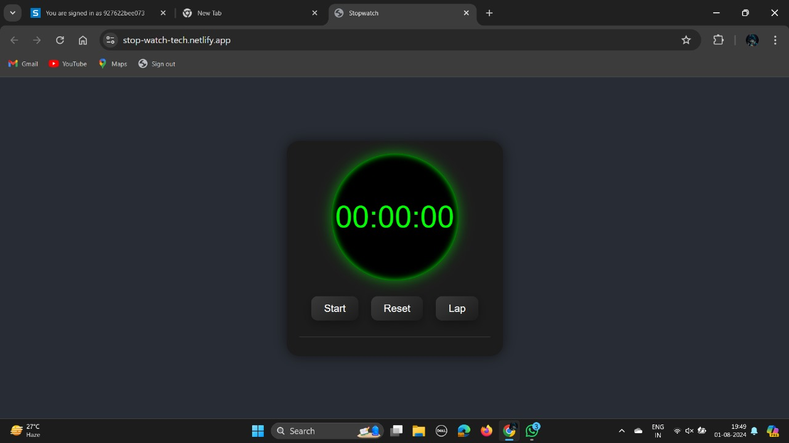

# Stopwatch Web Application

## Project Description

🚀 This project is part of my internship at Prodigy Infotech, where I built a stopwatch web application using HTML, CSS, and JavaScript. By implementing functions for starting, pausing, and resetting the stopwatch, as well as tracking and displaying lap times, users can accurately measure and record time intervals.

## Features

- **Start, Pause, Reset Functions**: Users can start, pause, and reset the stopwatch.
- **Lap Times**: Users can track and display lap times.
- **Responsive Design**: The application works seamlessly on different screen sizes.

## Technologies Used

- **HTML**: For structuring the application.
- **CSS**: For styling the application.
- **JavaScript**: For adding functionality and interactivity to the stopwatch.

## Screenshots


*Screenshot of the stopwatch web application.*

## Setup Instructions

1. **Clone the repository:**
   ```bash
   git clone https://github.com/Nareshbrabha/stopwatch-web-application.git
